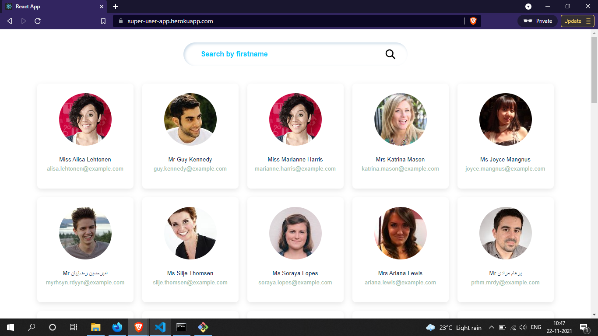
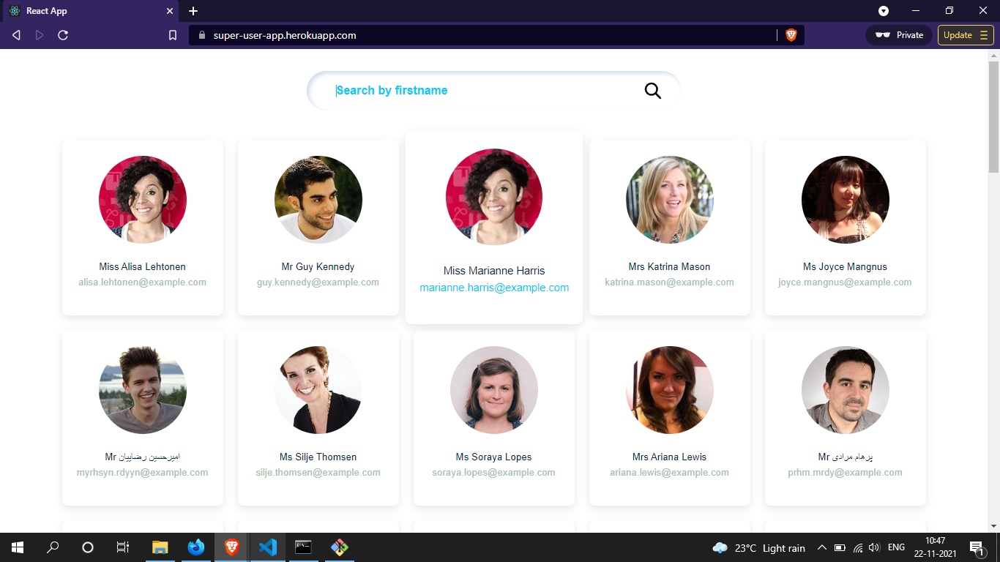
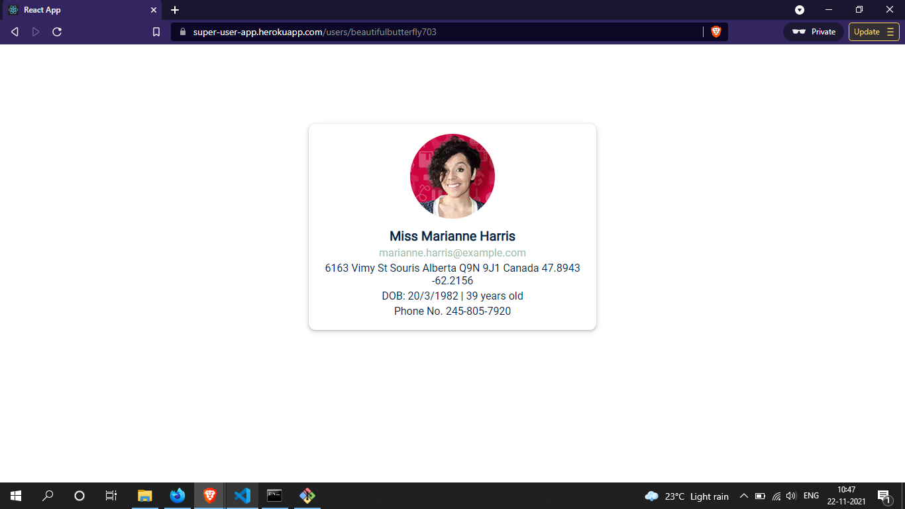

# SuperUser App
## Simple app built using React, Redux Saga, SASS and React-Router-DOM

We can view all the users and search a user by their firstname. A user can click on a card to view more info
about that particular user.


[Online Demo](https://super-user-app.herokuapp.com/)




### Usage

```
git clone https://github.com/Shivraj97/super-user-app.git
cd super-user-app
npm install
npm start
open http://localhost:3000  (should start automatically )
```

### Available Commands

```
npm start - start the dev server
npm run dev - create a developer build in `build` folder
npm run build - create a production ready build in `build` folder
```